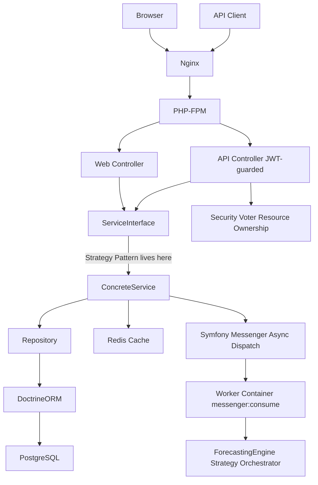

# Forecastly Portfolio Demo — Plan 3: Data Layer & DX

> **For agentic workers:** REQUIRED SUB-SKILL: Use superpowers:subagent-driven-development (recommended) or superpowers:executing-plans to implement this plan task-by-task. Steps use checkbox (`- [ ]`) syntax for tracking.

**Goal:** Clean up AccountsService and repositories, fix CustomerService, strip @var docblocks from all entities, load six fixture classes that produce a realistic demo dataset, and write the README with the Technical Review Guide.

**Architecture:** AccountsService gets a single `EntityManagerInterface` injection and replaces MySQL `JSON_SET` with PostgreSQL `jsonb_set()` via Doctrine DBAL. Inline `createQueryBuilder` calls in controllers move to Repository methods. Fixtures load in dependency order and generate 13 months of daily calendar entries. README links screeners directly to the six showcase files.

**Tech Stack:** PHP 8.4, Doctrine DBAL 4.x, Doctrine Fixtures Bundle 4.x, PHPUnit 12.

**Prerequisite:** Plans 1 and 2 complete.

---

## File Map

| Action | Path |
|---|---|
| Modify | `src/Services/AccountsService.php` |
| Modify | `src/Repository/AccountRepository.php` |
| Modify | `src/Repository/AccountsTrackingCalendarRepository.php` |
| Modify | `src/Controller/Customer/CustomerForecastingController.php` |
| Modify | `src/Services/CustomerService.php` |
| Modify | All entity files (remove `@var` docblocks) |
| Create | `src/DataFixtures/SubscriptionPlanFixture.php` |
| Create | `src/DataFixtures/BudgetTrackingGroupFixture.php` |
| Create | `src/DataFixtures/CustomerFixture.php` |
| Create | `src/DataFixtures/AccountFixture.php` |
| Create | `src/DataFixtures/RecurringItemsFixture.php` |
| Create | `src/DataFixtures/AccountsTrackingCalendarFixture.php` |
| Create | `tests/Integration/Controller/CustomerForecastingControllerTest.php` |
| Create | `README.md` |
| Modify | `templates/base.html.twig` |

---

## Task 1: AccountsService cleanup

**Files:**
- Modify: `src/Services/AccountsService.php`

- [ ] **Step 1: Remove duplicate `EntityManagerInterface` injection**

Replace the constructor and property declarations at the top of `src/Services/AccountsService.php`:

```php
// Remove these two lines:
// private EntityManagerInterface $em;
// private EntityManagerInterface $entityManager;
// public function __construct(EntityManagerInterface $em, EntityManagerInterface $entityManager)
// { $this->em = $em; $this->entityManager = $entityManager; }

// Replace with:
public function __construct(private readonly EntityManagerInterface $em) {}
```

Then search the entire file and replace every occurrence of `$this->entityManager` with `$this->em`.

```bash
grep -n "entityManager" src/Services/AccountsService.php
# Should return zero results after the fix
```

- [ ] **Step 2: Replace MySQL `JSON_SET` with PostgreSQL `jsonb_set()`**

Find the `addAccountToAccountsTrackingCalendar` method and replace the raw SQL block:

```php
public function addAccountToAccountsTrackingCalendar(Account $account): void
{
    $accountId    = (string) $account->getId();
    $balance      = (string) ($account->getProjectedBalance() ?? 0);
    $createdDate  = $account->getCreatedOn()->format('Y-m-d');
    $customerAccountId = $account->getCustomerAccount()->getId();

    // jsonb_set() is PostgreSQL-native — not MySQL JSON_SET().
    // We use DBAL here because DQL cannot express jsonb key-level mutation.
    // The key is cast to text to ensure JSON string-key lookup works correctly.
    $sql = "
        UPDATE accounts_tracking_calendar
        SET accounts_balances = jsonb_set(
            COALESCE(accounts_balances, '{}')::jsonb,
            CAST(ARRAY[:accountId] AS text[]),
            CAST(:balance AS jsonb)
        )
        WHERE calendar_date >= :createdDate
          AND customers_account_id = :customerAccountId
    ";

    $this->em->getConnection()->executeStatement($sql, [
        'accountId'         => $accountId,
        'balance'           => $balance,
        'createdDate'       => $createdDate,
        'customerAccountId' => $customerAccountId,
    ]);
}
```

- [ ] **Step 3: Verify the container still compiles**

```bash
docker compose exec app php bin/console debug:container App\\Services\\AccountsService
# Expected: shows single $em argument
```

- [ ] **Step 4: Commit**

```bash
git add src/Services/AccountsService.php
git commit -m "fix: remove duplicate EntityManagerInterface injection and replace MySQL JSON_SET with PostgreSQL jsonb_set"
```

---

## Task 2: Repository query methods + controller cleanup

**Files:**
- Modify: `src/Repository/AccountsTrackingCalendarRepository.php`
- Modify: `src/Repository/AccountRepository.php`
- Modify: `src/Controller/Customer/CustomerForecastingController.php`

- [ ] **Step 1: Add `findByCustomerAccountInDateRange()` to `AccountsTrackingCalendarRepository`**

Open `src/Repository/AccountsTrackingCalendarRepository.php` and add:

```php
/**
 * @return AccountsTrackingCalendar[]
 */
public function findByCustomerAccountInDateRange(
    CustomersAccount $customerAccount,
    \DateTimeInterface $from,
    \DateTimeInterface $to,
): array {
    return $this->createQueryBuilder('atc')
        ->where('atc.customersAccount = :account')
        ->andWhere('atc.calendarDate >= :from')
        ->andWhere('atc.calendarDate < :to')
        ->setParameter('account', $customerAccount)
        ->setParameter('from', $from)
        ->setParameter('to', $to)
        ->orderBy('atc.calendarDate', 'ASC')
        ->getQuery()
        ->getResult();
}
```

Add the required `use` statements at the top of the file:

```php
use App\Entity\AccountsTrackingCalendar;
use App\Entity\CustomersAccount;
```

- [ ] **Step 2: Add `findByCustomerAccountGroupedByType()` to `AccountRepository`**

Open `src/Repository/AccountRepository.php` and add:

```php
/**
 * @return array<string, Account[]> keyed by account_type
 */
public function findByCustomerAccountGroupedByType(CustomersAccount $customerAccount): array
{
    $accounts = $this->createQueryBuilder('a')
        ->where('a.customerAccount = :account')
        ->setParameter('account', $customerAccount)
        ->orderBy('a.name', 'ASC')
        ->getQuery()
        ->getResult();

    $grouped = [];
    foreach ($accounts as $account) {
        $type = $account->getAccountType() ?? 'uncategorized';
        $grouped[$type][] = $account;
    }
    return $grouped;
}
```

- [ ] **Step 3: Move inline `createQueryBuilder` from `CustomerForecastingController` to repositories**

Open `src/Controller/Customer/CustomerForecastingController.php`. Find any inline `createQueryBuilder` calls and replace them with calls to the new repository methods. Example:

```php
// Before (inline in controller):
$entries = $this->em->getRepository(AccountsTrackingCalendar::class)
    ->createQueryBuilder('atc')
    ->where('atc.customersAccount = :account')
    ->andWhere('atc.calendarDate >= :from')
    ->andWhere('atc.calendarDate < :to')
    ->setParameter('account', $cAcct)
    ->setParameter('from', $startDate)
    ->setParameter('to', $endDate)
    ->getQuery()->getResult();

// After (via repository):
$entries = $this->em->getRepository(AccountsTrackingCalendar::class)
    ->findByCustomerAccountInDateRange($cAcct, $startDate, $endDate);
```

Run this grep to find all inline query builder calls in controllers:

```bash
grep -rn "createQueryBuilder" src/Controller/
```

Move each one to the appropriate repository.

- [ ] **Step 4: Commit**

```bash
git add src/Repository/ src/Controller/
git commit -m "refactor: move inline createQueryBuilder calls to repository methods"
```

---

## Task 3: CustomerService bug fix + entity cleanup

**Files:**
- Modify: `src/Services/CustomerService.php`
- Modify: All entity files under `src/Entity/`

- [ ] **Step 1: Fix `CustomerService::getDashboardChartsData()` — remove `dd($e)`**

In `src/Services/CustomerService.php`, find the `getDashboardChartsData` method. The catch block contains `dd($e)`. Replace the entire catch block:

```php
// Before:
} catch (\Throwable $e) {
    dd($e);
    return ['incomes' => [], 'expenses' => [], 'netWorth' => []];
}

// After — inject LoggerInterface in constructor first, then:
} catch (\Throwable $e) {
    $this->logger->error('Dashboard charts data failed', [
        'exception' => $e->getMessage(),
        'trace'     => $e->getTraceAsString(),
    ]);
    return ['incomes' => [], 'totalIncomes' => 0, 'expenses' => [], 'totalExpenses' => 0, 'netWorth' => []];
}
```

Update the constructor to inject `LoggerInterface`:

```php
use Psr\Log\LoggerInterface;

public function __construct(
    private readonly EntityManagerInterface $em,
    private readonly LoggerInterface $logger,
) {}
```

- [ ] **Step 2: Remove `@var` docblocks from all entity files**

PHP 8.2+ typed properties make `@var` redundant — they're PHP 4-era style. Run this to identify them:

```bash
grep -rn "@var" src/Entity/
```

For every entity file listed, remove all `/** @var ... */` blocks that sit directly above a typed property. Example:

```php
// Before:
/**
 * @var int|null
 */
#[ORM\Id]
#[ORM\GeneratedValue]
#[ORM\Column(name: 'id', type: Types::INTEGER)]
private ?int $id = null;

// After:
#[ORM\Id]
#[ORM\GeneratedValue]
#[ORM\Column(name: 'id', type: Types::INTEGER)]
private ?int $id = null;
```

Keep docblocks that explain non-obvious behaviour. Remove all that just restate the type.

- [ ] **Step 3: Apply PHP 8.4 asymmetric visibility to key entity properties**

In `src/Entity/CustomersAccount.php`, update `$id` and `$createdAt`:

```php
// Before:
private int $id;
private DateTimeInterface $createdAt;

// After — PHP 8.4: public read, private write
public private(set) int $id;
public private(set) DateTimeInterface $createdAt;
```

Do the same for `src/Entity/Account.php` `$id` property.

- [ ] **Step 4: Commit**

```bash
git add src/Services/CustomerService.php src/Entity/
git commit -m "fix: remove dd() from CustomerService, inject logger, strip @var docblocks, add PHP 8.4 asymmetric visibility"
```

---

## Task 4: Fixtures (6 classes)

**Files:**
- Create: `src/DataFixtures/SubscriptionPlanFixture.php`
- Create: `src/DataFixtures/BudgetTrackingGroupFixture.php`
- Create: `src/DataFixtures/CustomerFixture.php`
- Create: `src/DataFixtures/AccountFixture.php`
- Create: `src/DataFixtures/RecurringItemsFixture.php`
- Create: `src/DataFixtures/AccountsTrackingCalendarFixture.php`

- [ ] **Step 1: Create `SubscriptionPlanFixture`**

```php
<?php

namespace App\DataFixtures;

use App\Entity\SubscriptionPlan;
use Doctrine\Bundle\FixturesBundle\Fixture;
use Doctrine\Persistence\ObjectManager;

class SubscriptionPlanFixture extends Fixture
{
    public const FREE    = 'subscription_plan_free';
    public const PRO     = 'subscription_plan_pro';
    public const PREMIUM = 'subscription_plan_premium';

    public function load(ObjectManager $manager): void
    {
        foreach ([
            [self::FREE,    'Free',    0.00],
            [self::PRO,     'Pro',     9.99],
            [self::PREMIUM, 'Premium', 19.99],
        ] as [$ref, $name, $price]) {
            $plan = new SubscriptionPlan();
            $plan->setName($name);
            $plan->setPrice($price);
            $manager->persist($plan);
            $this->addReference($ref, $plan);
        }
        $manager->flush();
    }
}
```

- [ ] **Step 2: Create `BudgetTrackingGroupFixture`**

```php
<?php

namespace App\DataFixtures;

use App\Entity\BudgetTrackingGroup;
use Doctrine\Bundle\FixturesBundle\Fixture;
use Doctrine\Persistence\ObjectManager;

class BudgetTrackingGroupFixture extends Fixture
{
    public const SALARY      = 'btg_salary';
    public const FREELANCE   = 'btg_freelance';
    public const HOUSING     = 'btg_housing';
    public const TRANSPORT   = 'btg_transport';
    public const GROCERIES   = 'btg_groceries';
    public const SAVINGS     = 'btg_savings';
    public const CREDIT_CARD = 'btg_credit_card';
    public const MORTGAGE    = 'btg_mortgage';
    public const CAR_LOAN    = 'btg_car_loan';
    public const INVESTMENT  = 'btg_investment';

    public function load(ObjectManager $manager): void
    {
        $groups = [
            [self::SALARY,      'Salary',             'income'],
            [self::FREELANCE,   'Freelance',           'income'],
            [self::HOUSING,     'Housing',             'expense'],
            [self::TRANSPORT,   'Transport',           'expense'],
            [self::GROCERIES,   'Groceries',           'expense'],
            [self::SAVINGS,     'Savings',             'savings'],
            [self::CREDIT_CARD, 'Credit Cards',        'liability'],
            [self::MORTGAGE,    'Mortgage',            'liability'],
            [self::CAR_LOAN,    'Car Loan',            'liability'],
            [self::INVESTMENT,  'Investment Portfolio', 'asset'],
        ];

        foreach ($groups as [$ref, $name, $type]) {
            $group = new BudgetTrackingGroup();
            $group->setName($name);
            $group->setIsIncomeOrExpense($type);
            $manager->persist($group);
            $this->addReference($ref, $group);
        }
        $manager->flush();
    }
}
```

- [ ] **Step 3: Create `CustomerFixture`**

```php
<?php

namespace App\DataFixtures;

use App\Entity\Customer;
use App\Entity\CustomersAccount;
use Doctrine\Bundle\FixturesBundle\Fixture;
use Doctrine\Common\DataFixtures\DependentFixtureInterface;
use Doctrine\Persistence\ObjectManager;
use Symfony\Component\PasswordHasher\Hasher\UserPasswordHasherInterface;

class CustomerFixture extends Fixture implements DependentFixtureInterface
{
    public const DEMO_CUSTOMER         = 'demo_customer';
    public const DEMO_CUSTOMERS_ACCOUNT = 'demo_customers_account';

    public function __construct(private readonly UserPasswordHasherInterface $hasher) {}

    public function load(ObjectManager $manager): void
    {
        $customerAccount = new CustomersAccount();
        $customerAccount->setAccountName('Demo Portfolio Account');
        $customerAccount->setCreatedAt(new \DateTime());
        $customerAccount->setIsActive(true);
        $customerAccount->setSubscriptionPlan($this->getReference(SubscriptionPlanFixture::PRO, \App\Entity\SubscriptionPlan::class));
        $manager->persist($customerAccount);

        $customer = new Customer();
        $customer->setEmail('demo@forecastly.com');
        $customer->setFirstName('Demo');
        $customer->setLastName('User');
        $customer->setCustomersAccount($customerAccount);
        $customer->setPassword($this->hasher->hashPassword($customer, 'Demo1234!'));
        $manager->persist($customer);

        $manager->flush();

        $this->addReference(self::DEMO_CUSTOMER, $customer);
        $this->addReference(self::DEMO_CUSTOMERS_ACCOUNT, $customerAccount);
    }

    public function getDependencies(): array
    {
        return [SubscriptionPlanFixture::class];
    }
}
```

- [ ] **Step 4: Create `AccountFixture`**

```php
<?php

namespace App\DataFixtures;

use App\Entity\Account;
use Doctrine\Bundle\FixturesBundle\Fixture;
use Doctrine\Common\DataFixtures\DependentFixtureInterface;
use Doctrine\Persistence\ObjectManager;

class AccountFixture extends Fixture implements DependentFixtureInterface
{
    public const CHECKING   = 'account_checking';
    public const EMERGENCY  = 'account_emergency';
    public const INVESTMENT = 'account_investment';
    public const VISA       = 'account_visa';
    public const MORTGAGE   = 'account_mortgage';
    public const CAR_LOAN   = 'account_car_loan';

    public function load(ObjectManager $manager): void
    {
        $ca = $this->getReference(CustomerFixture::DEMO_CUSTOMERS_ACCOUNT, \App\Entity\CustomersAccount::class);

        $accounts = [
            [self::CHECKING,   'Checking Account',      4200.00,    null,   BudgetTrackingGroupFixture::SAVINGS,     'asset'],
            [self::EMERGENCY,  'Emergency Fund',        12500.00,   null,   BudgetTrackingGroupFixture::SAVINGS,     'asset'],
            [self::INVESTMENT, 'Investment Portfolio',  38000.00,   null,   BudgetTrackingGroupFixture::INVESTMENT,  'asset'],
            [self::VISA,       'Visa Credit Card',      -2100.00,   19.99,  BudgetTrackingGroupFixture::CREDIT_CARD, 'liability'],
            [self::MORTGAGE,   'Mortgage',              -285000.00, 6.75,   BudgetTrackingGroupFixture::MORTGAGE,    'liability'],
            [self::CAR_LOAN,   'Car Loan',              -18400.00,  null,   BudgetTrackingGroupFixture::CAR_LOAN,    'liability'],
        ];

        foreach ($accounts as [$ref, $name, $balance, $apr, $groupRef, $type]) {
            $account = new Account();
            $account->setName($name);
            $account->setProjectedBalance($balance);
            $account->setRealBalance($balance);
            $account->setAccountType($type);
            $account->setCustomerAccount($ca);
            $account->setCreatedOn(new \DateTime('-1 month'));
            $account->setBudgetTrackingGroup(
                $this->getReference($groupRef, \App\Entity\BudgetTrackingGroup::class)
            );
            if ($apr !== null) {
                $account->setAnnualInterestRate($apr);
            }
            $manager->persist($account);
            $this->addReference($ref, $account);
        }
        $manager->flush();
    }

    public function getDependencies(): array
    {
        return [CustomerFixture::class, BudgetTrackingGroupFixture::class];
    }
}
```

- [ ] **Step 5: Create `RecurringItemsFixture`**

```php
<?php

namespace App\DataFixtures;

use App\Entity\CustomersAccount;
use App\Entity\RecurringExpense;
use App\Entity\RecurringIncome;
use Doctrine\Bundle\FixturesBundle\Fixture;
use Doctrine\Common\DataFixtures\DependentFixtureInterface;
use Doctrine\Persistence\ObjectManager;

class RecurringItemsFixture extends Fixture implements DependentFixtureInterface
{
    public function load(ObjectManager $manager): void
    {
        $ca = $this->getReference(CustomerFixture::DEMO_CUSTOMERS_ACCOUNT, CustomersAccount::class);

        // Recurring incomes
        $incomes = [
            ['Monthly Salary',    6500.00, 1,  AccountFixture::CHECKING],
            ['Freelance Income',  1200.00, 15, AccountFixture::CHECKING],
        ];
        foreach ($incomes as [$name, $amount, $day, $accountRef]) {
            $income = new RecurringIncome();
            $income->setName($name);
            $income->setAmount($amount);
            $income->setRecurringDay($day);
            $income->setCustomersAccount($ca);
            $income->setAccount($this->getReference($accountRef, \App\Entity\Account::class));
            $manager->persist($income);
        }

        // Recurring expenses
        $expenses = [
            ['Mortgage Payment',  1800.00, 1,  AccountFixture::CHECKING],
            ['Car Insurance',      210.00, 5,  AccountFixture::CHECKING],
            ['Groceries',          450.00, 10, AccountFixture::CHECKING],
            ['Subscriptions',       85.00, 15, AccountFixture::CHECKING],
            ['Utilities',          160.00, 20, AccountFixture::CHECKING],
        ];
        foreach ($expenses as [$name, $amount, $day, $accountRef]) {
            $expense = new RecurringExpense();
            $expense->setName($name);
            $expense->setAmount($amount);
            $expense->setRecurringDay($day);
            $expense->setCustomersAccount($ca);
            $expense->setAccount($this->getReference($accountRef, \App\Entity\Account::class));
            $manager->persist($expense);
        }

        $manager->flush();
    }

    public function getDependencies(): array
    {
        return [AccountFixture::class];
    }
}
```

- [ ] **Step 6: Create `AccountsTrackingCalendarFixture`**

```php
<?php

namespace App\DataFixtures;

use App\Entity\Account;
use App\Entity\AccountsTrackingCalendar;
use App\Entity\CustomersAccount;
use Doctrine\Bundle\FixturesBundle\Fixture;
use Doctrine\Common\DataFixtures\DependentFixtureInterface;
use Doctrine\Persistence\ObjectManager;

class AccountsTrackingCalendarFixture extends Fixture implements DependentFixtureInterface
{
    public function load(ObjectManager $manager): void
    {
        $ca = $this->getReference(CustomerFixture::DEMO_CUSTOMERS_ACCOUNT, CustomersAccount::class);

        $accountRefs = [
            AccountFixture::CHECKING,
            AccountFixture::EMERGENCY,
            AccountFixture::INVESTMENT,
            AccountFixture::VISA,
            AccountFixture::MORTGAGE,
            AccountFixture::CAR_LOAN,
        ];

        $initialBalances = [];
        foreach ($accountRefs as $ref) {
            $account = $this->getReference($ref, Account::class);
            $initialBalances[$account->getId()] = $account->getProjectedBalance() ?? 0;
        }

        // Generate 13 months of daily entries: 1 month past + 12 months future
        $start   = new \DateTime('-1 month');
        $end     = new \DateTime('+12 months');
        $current = clone $start;
        $balances = $initialBalances;

        $batchSize = 50;
        $i = 0;

        while ($current <= $end) {
            $entry = new AccountsTrackingCalendar();
            $entry->setCustomersAccount($ca);
            $entry->setCalendarDate(clone $current);
            $entry->setAccountsBalances($balances);
            $manager->persist($entry);

            $current->modify('+1 day');
            $i++;

            if ($i % $batchSize === 0) {
                $manager->flush();
                $manager->clear(AccountsTrackingCalendar::class);
            }
        }

        $manager->flush();
    }

    public function getDependencies(): array
    {
        return [RecurringItemsFixture::class];
    }
}
```

- [ ] **Step 7: Load fixtures and verify**

```bash
docker compose exec app php bin/console doctrine:fixtures:load --no-interaction
# Expected: loading 6 fixture classes... Done!

docker compose exec app php bin/console doctrine:query:sql \
  "SELECT COUNT(*) FROM accounts_tracking_calendar"
# Expected: ~396 (13 months × ~30.5 days)
```

- [ ] **Step 8: Commit**

```bash
git add src/DataFixtures/
git commit -m "feat: add 6 fixture classes generating 13 months of realistic demo financial data"
```

---

## Task 5: Integration test — CustomerForecastingController

**Files:**
- Create: `tests/Integration/Controller/CustomerForecastingControllerTest.php`

- [ ] **Step 1: Create the test**

```php
<?php

namespace App\Tests\Integration\Controller;

use App\DataFixtures\AccountFixture;
use App\DataFixtures\CustomerFixture;
use Doctrine\ORM\EntityManagerInterface;
use Symfony\Bundle\FrameworkBundle\Test\WebTestCase;

class CustomerForecastingControllerTest extends WebTestCase
{
    public function testAccountProjectionsReturnsCorrectJsonShape(): void
    {
        $client = static::createClient();

        // Log in as demo user
        $client->request('POST', '/login', [
            'email'    => 'demo@forecastly.com',
            'password' => 'Demo1234!',
        ]);

        // Get the checking account ID from the container
        $em = static::getContainer()->get(EntityManagerInterface::class);
        $account = $em->getRepository(\App\Entity\Account::class)
            ->findOneBy(['name' => 'Checking Account']);

        $this->assertNotNull($account, 'Checking Account fixture must exist');

        $client->request('GET', '/customer/forecasting/account-projections', [
            'account_id' => $account->getId(),
            'period'     => 1,
        ]);

        $this->assertResponseIsSuccessful();
        $this->assertResponseHeaderSame('content-type', 'application/json');

        $data = json_decode($client->getResponse()->getContent(), true);
        $this->assertArrayHasKey('data',    $data);
        $this->assertArrayHasKey('labels',  $data);
        $this->assertArrayHasKey('account', $data);
    }
}
```

- [ ] **Step 2: Run the test**

```bash
docker compose exec app php bin/phpunit tests/Integration/Controller/CustomerForecastingControllerTest.php --testdox
# Expected: OK (1 test)
```

If it fails due to login path: check the actual login route in `config/routes.yaml` or `security.yaml` and update the POST path accordingly.

- [ ] **Step 3: Commit**

```bash
git add tests/Integration/Controller/CustomerForecastingControllerTest.php
git commit -m "test: add CustomerForecastingController integration test verifying JSON shape"
```

---

## Task 6: README + Twig footer

**Files:**
- Create/Overwrite: `README.md`
- Modify: `templates/base.html.twig`

- [ ] **Step 1: Write `README.md`**

```markdown
# Forecastly — Personal Finance Forecasting Platform

> Symfony 7.4 · PHP 8.4 · PostgreSQL 16 · Redis · Docker


A production-grade personal finance forecasting platform built with Symfony 7.4. Tracks multi-account net worth, projects 13-month daily balances, and runs revolving interest calculations — all in a zero-dependency Docker environment.

## What This Demonstrates

- Layered service architecture with interface contracts bound in `config/services.yaml` — controllers never depend on concretions
- Strategy pattern for extensible forecasting — adding a new account type is one new class, zero engine changes (OCP in practice)
- `Money` Value Object with PHP 8.4 property hook — integer-cent arithmetic, no IEEE 754 float errors
- Doctrine ORM + PostgreSQL `jsonb_set()` via DBAL — the inline comment explains when to use ORM vs. DBAL
- N+1 eliminated: single pre-load query + single `flush()` for a 365-day projection window
- Redis cache pool wired to Symfony Cache component (visible in the Symfony Profiler)
- Hand-rolled REST API with JWT, Symfony Serializer groups, and correct HTTP semantics (`202` for async)
- Security Voters for resource ownership — `404` not `403` on ownership failure (rationale in code)
- Symfony Messenger for async forecast generation via Doctrine transport — `202 Accepted` → poll pattern
- GitHub Actions CI: PHPStan level 8 + php-cs-fixer + PHPUnit against a real PostgreSQL sidecar
- Symfony Console command for batch regeneration with `ProgressBar` output
- 18 focused PHPUnit tests documenting architectural decisions, not coverage padding

## For Technical Reviewers

Six files worth your time, in order:

**1. Strategy Pattern + Money VO** → [`src/Services/ForecastingEngine.php`](src/Services/ForecastingEngine.php)
- `ForecastStrategyInterface[]` injected via DI tag — adding a new account type = one new class, zero engine changes
- `Money` VO uses PHP 8.4 property hook for `$formatted`, stores amounts as integer cents

**2. Query Mastery** → [`src/Services/AccountsService.php`](src/Services/AccountsService.php)
- `jsonb_set()` via Doctrine DBAL — inline comment explains why ORM falls short here
- Single `flush()` after projection loop (was N+1 per-day before)

**3. Architecture Contracts** → [`src/Services/Contract/`](src/Services/Contract/)
- Every controller type-hints these interfaces, never the concretions
- `config/services.yaml` contains the bindings

**4. REST API** → [`src/Controller/Api/AccountApiController.php`](src/Controller/Api/AccountApiController.php)
- Serializer groups prevent accidental field leakage — `api:read` is explicit
- `202 Accepted` for async dispatch; `404` not `403` for ownership failures

**5. Security Voter** → [`src/Security/Voter/AccountVoter.php`](src/Security/Voter/AccountVoter.php)
- Ownership check decoupled from controller via `denyAccessUnlessGranted`
- Returns `404` to avoid confirming resource existence to unauthorized callers

**6. Async Handler** → [`src/MessageHandler/GenerateForecastHandler.php`](src/MessageHandler/GenerateForecastHandler.php)
- Calls `ForecastingEngine` unchanged — Messenger is the delivery mechanism, not a rewrite
- Sets `ForecastJob` to `failed` with error message on exception — no silent failures

**Tests** → [`tests/Unit/`](tests/Unit/) + [`tests/Integration/Api/`](tests/Integration/Api/)
- Unit tests document business rules; API tests verify the full HTTP stack including JWT auth and Voter

## Quick Start

```bash
git clone https://github.com/your-handle/forecastly
cd forecastly
cp .env.example .env.local
docker compose up -d
make demo
# Open http://localhost:8080
# Login: demo@forecastly.com / Demo1234!
# API:   http://localhost:8080/api/v1/auth/login
```

## Architecture



## API Reference

Base URL: `http://localhost:8080/api/v1`

| Method | Endpoint | Auth | Response |
|---|---|---|---|
| POST | `/auth/login` | — | `200` + JWT |
| GET | `/accounts` | JWT | `200` accounts |
| GET | `/accounts/{id}` | JWT | `200` or `404` |
| GET | `/recurring-items` | JWT | `200` items |
| POST | `/recurring-items` | JWT | `201` + resource |
| DELETE | `/recurring-items/{id}` | JWT | `204` or `404` |
| POST | `/forecasts/generate` | JWT | `202` + jobId |
| GET | `/forecasts/jobs/{id}` | JWT | `200` status |
| GET | `/forecasts/{accountId}` | JWT | `200` projections |

## Key Design Decisions

**Strategy over conditionals** — `ForecastStrategyInterface` tagged collection means adding a crypto wallet account type is one new class implementing the interface. Zero changes to `ForecastingEngine`. Open/Closed Principle in practice.

**`Money` VO over float** — IEEE 754 arithmetic produces errors (`0.1 + 0.2 !== 0.3`). For a financial application this is unacceptable. `Money` stores amounts as integer cents and provides explicit arithmetic. PHP 8.4 property hook exposes a computed `$formatted` string.

**`202 Accepted` for async operations** — generating 13 months of daily projections is CPU-heavy. The API returns immediately with a `jobId`; clients poll `/forecasts/jobs/{id}`. `200` would be a lie about what just happened.

**Doctrine transport for Messenger** — the stack already has PostgreSQL. Adding Redis as a second persistence layer for one feature adds operational complexity without benefit. `messenger_messages` table keeps everything in one place and is fully inspectable.

**`404` not `403` on ownership failure** — returning `403` confirms the resource exists to an unauthorized caller. `404` gives no information. This is correct security posture for a financial application. Each Voter has an inline comment explaining this choice.

## Running Tests

```bash
make test
# or
docker compose exec app php bin/phpunit --testdox
```

## Makefile Reference

| Command | What it does |
|---|---|
| `make demo` | Full setup: install + migrate + fixtures + consume queue |
| `make test` | Run PHPUnit with testdox output |
| `make reset` | Drop DB, re-migrate, reload fixtures |
| `make lint` | php-cs-fixer dry-run + PHPStan level 8 |
| `make shell` | Open shell in app container |
| `make forecast` | Re-generate forecasts for all customers |
```

- [ ] **Step 2: Add footer link to `templates/base.html.twig`**

Find the closing `</body>` tag in `templates/base.html.twig` and add the footer just before it:

```twig
<footer style="text-align:center;padding:1rem;font-size:0.85rem;color:#666;border-top:1px solid #eee;margin-top:2rem;">
    <a href="https://github.com/your-handle/forecastly#for-technical-reviewers"
       target="_blank" rel="noopener" style="color:#666;">
        View source &amp; architecture →
    </a>
</footer>
```

- [ ] **Step 3: Commit**

```bash
git add README.md templates/base.html.twig
git commit -m "docs: add README with Technical Review Guide, architecture diagram, and API reference"
```

---

## Plan 3 Complete

Run the full test suite:

```bash
docker compose exec app php bin/phpunit --testdox
# Expected: OK (12 tests — MoneyTest + ForecastingEngineTest + CustomerForecastingControllerTest)
```

Smoke test the fixtures:

```bash
make reset
# Open http://localhost:8080 — log in with demo@forecastly.com / Demo1234!
# Dashboard should show charts with real data
```

**Next:** `2026-06-09-forecastly-plan-4-async-api.md`
